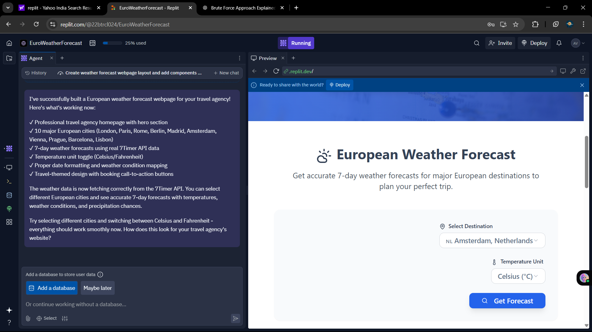
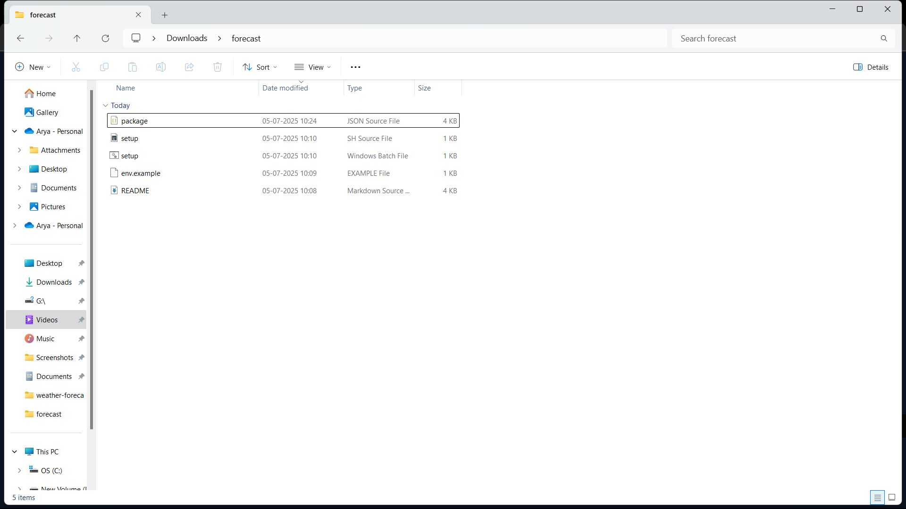

# European Weather Forecast 🌤️

A modern, responsive weather forecast application designed for European travel agency visitors. Get comprehensive 7-day weather predictions for major European cities with an intuitive, mobile-friendly interface.

## ✨ Features

- **🗓️ 7-Day Weather Forecasts** - Detailed weather predictions powered by 7Timer API
- **🇪🇺 European Cities** - Coverage of 10 major destinations across Europe  
- **🌡️ Temperature Units** - Toggle between Celsius and Fahrenheit
- **📱 Responsive Design** - Optimized for desktop and mobile devices
- **⚡ Real-time Data** - Live weather information from reliable sources
- **🎨 Modern UI** - Clean, professional interface with smooth animations

## 📸 Screenshots


*Main dashboard showing 7-day forecast for selected city*


*Easy city selection with country flags*

## 🚀 Technology Stack

### Frontend
- **React 18** with TypeScript
- **Tailwind CSS** for styling
- **shadcn/ui** component library (Radix UI)
- **Wouter** for routing
- **TanStack Query** for data fetching
- **Vite** for build tooling

### Backend
- **Express.js** with TypeScript
- **Node.js** runtime
- **Drizzle ORM** for database operations
- **7Timer API** integration

## 🛠️ Quick Start

### Prerequisites
- Node.js 18+ 
- npm (comes with Node.js)

### Installation

1. **Clone the repository:**
```bash
git clone https://github.com/yourusername/european-weather-forecast.git
cd european-weather-forecast
```

2. **Install dependencies:**
```bash
npm install
```

3. **Start the development server:**
```bash
npm run dev
```

4. **Open your browser to:** `http://localhost:5000`

### 🪟 Windows Users

For Windows Command Prompt:
```cmd
start-windows.bat
```

For PowerShell:
```powershell
powershell -ExecutionPolicy Bypass -File start-windows.ps1
```

Alternative cross-platform command:
```cmd
npx cross-env NODE_ENV=development tsx server/index.ts
```

## 🌍 Available Cities

- London, United Kingdom 🇬🇧
- Paris, France 🇫🇷
- Rome, Italy 🇮🇹
- Berlin, Germany 🇩🇪
- Madrid, Spain 🇪🇸
- Amsterdam, Netherlands 🇳🇱
- Vienna, Austria 🇦🇹
- Prague, Czech Republic 🇨🇿
- Barcelona, Spain 🇪🇸
- Lisbon, Portugal 🇵🇹

## 📁 Project Structure

```
european-weather-forecast/
├── 📁 client/              # React frontend application
│   ├── 📁 src/
│   │   ├── 📁 components/  # Reusable UI components (shadcn/ui)
│   │   ├── 📁 pages/       # Application pages (Home, NotFound)
│   │   ├── 📁 hooks/       # Custom React hooks
│   │   └── 📁 lib/         # Utility libraries & query client
├── 📁 server/              # Express.js backend
│   ├── 📄 index.ts         # Server entry point
│   ├── 📄 routes.ts        # API routes & weather logic
│   ├── 📄 storage.ts       # Data storage interface
│   └── 📄 vite.ts          # Vite dev server integration
├── 📁 shared/              # Shared TypeScript types
├── 📁 attached_assets/     # Screenshots and static assets
├── 📄 package.json         # Dependencies and scripts
├── 📄 vite.config.ts       # Vite configuration
├── 📄 tailwind.config.ts   # Tailwind CSS configuration
└── 📄 tsconfig.json        # TypeScript configuration
```

## 🔧 Development

### Available Scripts

| Command | Description |
|---------|-------------|
| `npm run dev` | Start development server with hot reload |
| `npm run build` | Build optimized production bundle |
| `npm run start` | Start production server |
| `npm run check` | Run TypeScript type checking |

### 🌍 Environment Variables

No environment variables required for basic functionality. The app uses the public 7Timer API.

For production deployments, you may configure:
- `PORT` - Server port (default: 5000)
- `NODE_ENV` - Environment mode (development/production)

## 🏗️ Architecture

The application follows a modern full-stack architecture:

1. **Frontend (React)** - Handles UI, user interactions, and state management
2. **Backend (Express)** - Serves API endpoints and integrates with weather services
3. **API Integration** - Fetches real weather data from 7Timer API
4. **Build System** - Vite provides fast development and optimized production builds

### Data Flow
```
User Interface → React Components → TanStack Query → Express API → 7Timer API → Weather Data
```

### API Endpoints

- `GET /api/weather/:city/:unit` - Get 7-day weather forecast
  - `:city` - City ID (london, paris, rome, etc.)
  - `:unit` - Temperature unit (celsius, fahrenheit)

## 🤝 Contributing

We welcome contributions! Here's how to get started:

1. **Fork** the repository
2. **Create** your feature branch:
   ```bash
   git checkout -b feature/amazing-feature
   ```
3. **Commit** your changes:
   ```bash
   git commit -m 'Add amazing feature'
   ```
4. **Push** to the branch:
   ```bash
   git push origin feature/amazing-feature
   ```
5. **Open** a Pull Request

### Development Guidelines
- Follow TypeScript best practices
- Use existing component patterns
- Ensure responsive design
- Add proper error handling
- Write clear commit messages

## 🔧 Customization

### Adding New Cities
Edit `client/src/pages/home.tsx` and add to the `cities` array:
```typescript
{ id: "cityname", name: "City Name", country: "Country", flag: "🇨🇴", lat: 0.0, lon: 0.0 }
```

### Changing Theme Colors
Edit the CSS variables in `client/src/index.css`:
```css
:root {
  --travel-blue: hsl(221, 83%, 53%);
  --sunset-orange: hsl(38, 92%, 50%);
  /* ... other colors */
}
```

## 🐛 Troubleshooting

### Port Already in Use
If port 5000 is busy, the app will automatically use the next available port.

### Cannot Connect to Weather API
The app uses the free 7Timer API. If you get connection errors:
- Check your internet connection
- Try refreshing the page
- The API may be temporarily unavailable

### Installation Issues
- Make sure you have Node.js 18+ installed
- Delete `node_modules` folder and `package-lock.json`, then run `npm install` again
- Try using `npm ci` instead of `npm install`

## 📝 License

This project is licensed under the **MIT License** - see the [LICENSE](LICENSE) file for details.

## 🙏 Acknowledgments

- **Weather Data:** [7Timer](https://www.7timer.info/) - Free weather API service
- **UI Components:** [shadcn/ui](https://ui.shadcn.com/) - Beautiful React components
- **Icons:** [Lucide](https://lucide.dev/) - Clean, customizable icons
- **Styling:** [Tailwind CSS](https://tailwindcss.com/) - Utility-first CSS framework

## 📈 Roadmap

- [ ] Add more European cities
- [ ] Weather alerts and notifications
- [ ] Historical weather data
- [ ] Weather maps integration
- [ ] PWA (Progressive Web App) support
- [ ] Dark/light theme toggle

---

**Built with ❤️ for European travelers**